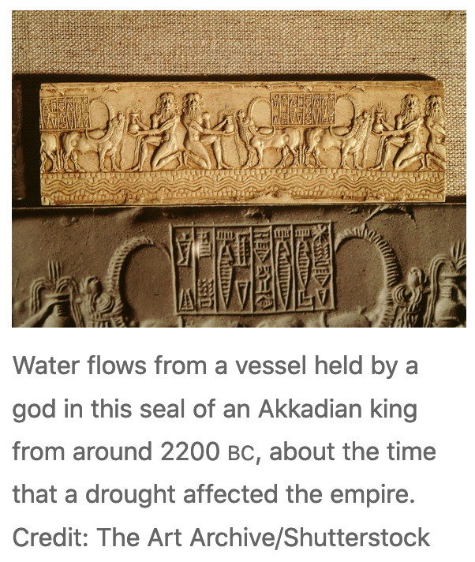
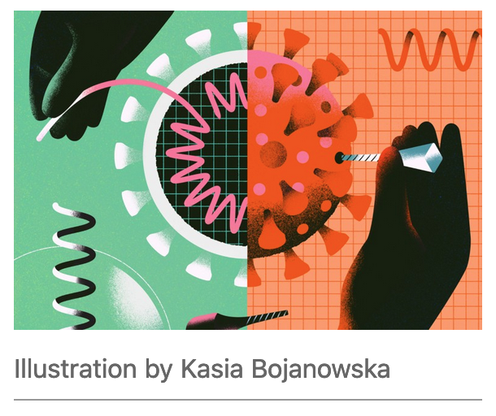
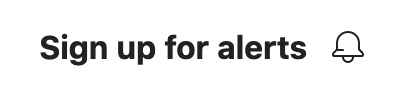

# Alt text

- [What is alt text?](#what-is-alt-text)
- [What's it for?](#whats-it-for)
- [What isn't it for?](#what-isnt-it-for)
- [Is alt text _always_ necessary?](#is-alt-text-always-necessary)
- [How to write alt text](#how-to-write-alt-text)
  - [A few guiding principles](#a-few-guiding-principles)
- [Examples](#examples)
  - [A photograph of an object](#a-photograph-of-an-object)
    - [Good alt text](#good-alt-text)
    - [Bad alt text](#bad-alt-text)
  - [An abstract illustration](#an-abstract-illustration)
    - [Good alt text](#good-alt-text-1)
    - [Bad alt text](#bad-alt-text-1)
  - [An icon](#an-icon)
    - [Good alt text](#good-alt-text-2)
    - [Bad alt text](#bad-alt-text-2)
  - [Headshots](#headshots)
    - [Bad alt text](#bad-alt-text-3)
    - [Good alt text](#good-alt-text-3)

## What is alt text? 

It's text used to describe the appearance and function of an image on a page, a textual alternative to non-text content. You don't normally see it when you're browsing a page as a sighted web user. 

## What's it for? 

Alt text is a key principle of web accessibility. Blind or low vision screen reader users may read alt attributes instead of seeing an image. [Images without an alt attribute](https://github.com/springernature/frontend-playbook/blob/main/accessibility/common-remediations/images.md#images-with-no-alt-attribute), or with inappropriate alt text, are not accessible to these people.

Alt text also displays in place of an image if an image file can’t be loaded.

Alt text can be crawled by search engines, helping them to index a page properly.

## What _isn't_ it for?

Alt text isn't the same as caption text, which is always visible. Caption text adds additional context to an image, but doesn’t describe the image content.

Alt text isn’t for describing the design or layout of the page. Text like “main graphic” isn’t useful to describe an image. 

## Is alt text _always_ necessary?

No. If an image has no meaning, or if it's providing information that's redundant because the information already exists in adjacent text, its alt text should be left blank. But be careful with this - don't just decide an image has no meaning without carefully considering its purpose. If a page has images that carry no meaning, why does it have the images there at all? 

An image MUST always have an alt _attribute_, even if its value is blank (`alt=""`). Your HTML isn't valid without one. 

## How to write alt text

There isn’t a hard and fast rule. The alt text for a particular image may change depending on the context, and what kind of content the image is used within.

Remember what you're trying to achieve - someone who can't see the image needs to be able to get the same _information_ from your alt text. 

### A few guiding principles

* Don’t say ‘Image of…’ or ‘Picture of…’ etc.  
* Don’t need to repeat information already given in the text on the page.  
* Be as succinct as possible but include details as needed. (There is no character limit despite some guidance stating otherwise, [a screen reader won't truncate alt text.](https://yatil.net/blog/there-is-no-character-limit-for-alt-text)) 
* Copyright info, image source, or other extra information should go in the caption, not the alt text.
* Context is important e.g. it may be appropriate to note if an image is a photo or an artwork, whether a person is old or young, if the sky is stormy or clear, if that is relevant to the content. 
* Think about how you would describe the image to a person who can’t see it.

## Examples

### A photograph of an object

The article [Did a mega drought topple empires 4,200 years ago?](https://www.nature.com/articles/d41586-022-00157-9) leads with a large photograph of an Akkadian bas relief. Below, there's a visible caption that summarises the image context ("Water flows from a vessel held by a god..."), and credits the image source (The Art Archive/Shutterstock). 

#### Good alt text

"Relief created from a cylinder seal from the Akkad dynasty showing water gods and buffalo" 

This is the alt text used in the article. It describes the physical object (the bas relief), the style of the object (Akkadian dynasty) and the scene it depicts (the water gods and buffalo).

#### Bad alt text

Here are some possibilities for alt text that doesn't have enough information to be a sufficient text alternative:

* "Bas relief"
* "Photo"
* 
* "Hero image" or "main graphic" or "leader image"

Another mistake would be to repeat the visible caption text in alt text:

"Water flows from a vessel held by a god in this seal of an Akkadian king from around 2200 bc, about the time that a drought affected the empire. Credit: The Art Archive/Shutterstock"

Screen reader users don't need to hear this information twice. 

### An abstract illustration

In [The shifting sands of ‘gain-of-function’ research](https://www.nature.com/articles/d41586-021-02903-x), the leader image is a stylised illustration. There's a visible caption that gives the name of the illustrator ("Illustration by Kasia Bojanowska"). 

#### Good alt text

"Conceptual illustration showing a virus being edited."

This is the alt text used in the article. It describes what's happening in the image (a virus being edited), and explains that the image isn't real ("conceptual illustration"). 

#### Bad alt text

* "Illustration" (or "Illustration by Kasia Bojanowska", already visible in the caption)
* 
* "Hero image" or "main graphic" or "leader image"

All of the above fail to describe the contents of the image in a way that gives equivalent information.

### An icon

On Nature.com, we sometimes use icons to support text labels, like this bell icon beside the "Sign up for alerts" link. 

#### Good alt text

`alt=""`

This is the alt text used in the label. Not a typo! Yes, it's blank. The purpose of the link is already described by the text label, so the icon is redundant. Redundant here doesn't mean unnecessary -- the icon can serve as a speedy shorthand for people who are visually scanning the page -- it only means that the key information has already been provided in text. 

#### Bad alt text

* "icon"
* "bell"

The above possibilities are extraneous information that don't help screen reader users understand the purpose of the link that the image tries to describe. 

* "Sign up for alerts"
* "Click here to sign up for alerts"

The visible text is already visible. You don't need to add it to the alt text too - screen reader users don't need to hear it twice.

### Headshots

Headshots are more complex than they appear at first glance, and your decisions will depend on multiple factors. It's probably easiest to start with the bad examples:

#### Bad alt text

* "headshot"
* "speaker"
* "photograph of…"
* alt text that just repeats the indvidual's name when the individual's name is already available in visible adjacent text

#### Good alt text

This depends on what you're trying to achieve. If all your headshots are business-friendly photographs of people smiling professionally into the camera AND there's not much to distinguish them from each other (business-friendly photographs are notoriously bland and similar to each other) AND their names are clearly visible in text adjacent on the page, you might want to consider using blank alt text (`alt=""`) for the headshot pictures. 

If your headshots are of people doing interesting or quirky things that are intended to show the individual's personality or interests, you might want to highlight that in the alt text, e.g. "Person's Name holding up a goose", or "Other Person swallowing a sword". 

Similarly, if it's important on your page to demonstrate diversity (for example if it's to promote a conference that talks about diversity in your industry), AND if the people whose headshots you're using are comfortable with it, you might include ethnic, race, gender, or disability markers in your alt text, e.g. "Important Person wearing an electric blue hijab", "Name McName wearing a sequinned eyepatch". 

However, you MUST be careful with this - not everyone is comfortable with having their markers described in this way by other people. Google's developer advocate Jake Archibald says, "Generally, we get speakers to write their own bios for conference sites. Since they choose how to be represented in the bio, it seems sensible to ask them to write their avatar alt text too." Consider doing this. 

##### Further reading on headshot considerations

* [Writing great alt text: Emotion matters](https://jakearchibald.com/2021/great-alt-text/)
* [Thoughts on skin tone and text descriptions](https://tink.uk/thoughts-on-skin-tone-and-text-descriptions.md-notes-on-synthetic-speech/), by Léonie Watson

