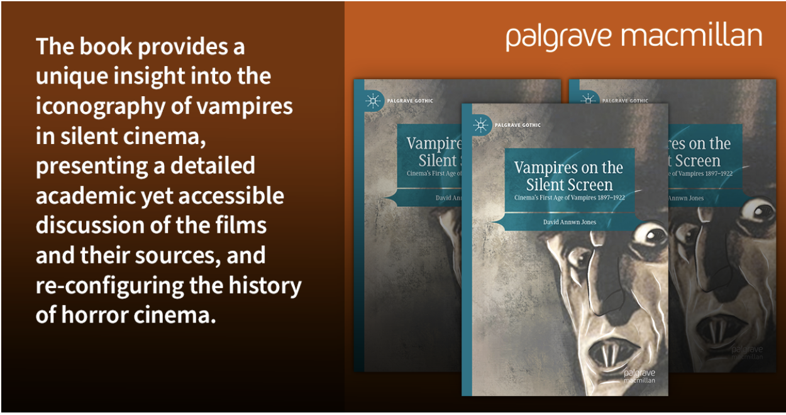

# Alt text

- [What is alt text?](#what-is-alt-text)
- [What's it for?](#whats-it-for)
- [What isn't it for?](#what-isnt-it-for)
- [Is alt text _always_ necessary?](#is-alt-text-always-necessary)
- [How long should the alt text be?](#how-long-should-the-alt-text-be)
  - [How do screen readers render alt text?](#how-do-screen-readers-render-alt-text)
- [How to write alt text](#how-to-write-alt-text)
  - [A few guiding principles](#a-few-guiding-principles)
- [Examples](#examples)
  - [A photograph of an object](#a-photograph-of-an-object)
    - [Sufficient alt text](#sufficient-alt-text)
    - [Insufficient alt text](#insufficient-alt-text)
  - [An abstract illustration](#an-abstract-illustration)
    - [Sufficient alt text](#sufficient-alt-text-1)
    - [Insufficient alt text](#insufficient-alt-text-1)
  - [An icon](#an-icon)
    - [Sufficient alt text](#sufficient-alt-text-2)
    - [Insufficient alt text](#insufficient-alt-text-2)
  - [Headshots](#headshots)
    - [Insufficient alt text](#insufficient-alt-text-3)
    - [Sufficient alt text](#sufficient-alt-text-3)
  - [Images of text](#images-of-text)
    - [Insufficient alt text](#insufficient-alt-text-4)
    - [Sufficient alt text](#sufficient-alt-text-4)

## What is alt text? 

It's text used to describe the appearance and function of an image on a page, a textual alternative to non-text content. You don't normally see it when you're browsing a page as a sighted web user. 

## What's it for? 

Alt text is a key principle of web accessibility. Blind or low vision screen reader users may read alt attributes instead of seeing an image. [Images without an alt attribute](https://github.com/springernature/frontend-playbook/blob/main/accessibility/common-remediations/images.md#images-with-no-alt-attribute), or with inappropriate alt text, are not accessible to these people.

Alt text also displays in place of an image if an image file can’t be loaded.

Alt text can be crawled by search engines, helping them to index a page properly.

## What _isn't_ it for?

Alt text isn't the same as caption text, which is always visible. Caption text adds additional context to an image, but doesn’t describe the image content.

Alt text isn’t for describing the design or layout of the page. Text like “main graphic” isn’t useful to describe an image. 

## Is alt text _always_ necessary?

No. If an image has no meaning, or if it's providing information that's redundant because the information already exists in adjacent text, its alt text should be left blank. But be careful with this - don't just decide an image has no meaning without carefully considering its purpose. If a page has images that carry no meaning, why does it have the images there at all? 

An image MUST always have an alt _attribute_, even if its value is blank (`alt=""`). Your HTML isn't valid without one. 

## How long should the alt text be? 

The length any given alt text _should_ be depends on how long the alt text _needs_ to be. 

Despite what you may have read or heard in the past, [there is no hard character limit imposed by browsers or screen readers](https://yatil.net/blog/there-is-no-character-limit-for-alt-text). This doesn't mean you should write a novel every time. A simple logo will need a lot less alt text than a chart or a graph as the logo image itself carries less information. 

You MUST keep alt text in HTML as succinct as you reasonably can while still expressing all the information in the image. To understand why, you need to understand how screen readers parse attributes like `alt`. 

### How do screen readers render alt text? 

Screen readers look at all of the HTML markup on a page, then announce the contents to the user in different ways depending on what kind of element it's describing. For example a link might be announced as something like "Link: my cool website address". A navigation menu might be announced like "Navigation: breadcrumb". These are examples of HTML element nodes. Screen reader users can command their screen reader to move around the page and describe different things at will. They can move forwards or backwards through text, read text at the character level (for example to confirm spelling), and pause and restart later, among other useful operations. 

Many HTML element nodes can contain attributes. A link may use a `title` attribute, like this ([though I do not recommend it](https://github.com/springernature/frontend-playbook/blob/main/accessibility/common-remediations/html-attributes.md)): `<a href="/" title="don't do this">my cool website address</a>`. The alt attribute is also of this type: ``. Attributes can't be interacted with in the same way as the rest of the page - you can't move forwards or backwards through the text, you can't read the text at the character level, and you can't pause the screen reader and restart later where you left off. 

Imagine you're sitting at a bus stop, and the bus company has added a digital marquee to the shelter to give you important information. You can't control the marquee at all, you can only look at it, passively, on its own schedule. If you're momentarily distracted, causing you to miss the information you needed about your bus, the only thing you can do is wait for it to return to the start and then (eventually) get to the part you were interested in. Tiresome, right? This is similar to the experience of using alt text with a screen reader. Although the screen reader user can go back to start whenever they want, if your alt text is 1000 characters long and the information they need to hear again starts after 850 words, this person is going to be waiting for a very long time. 

If the information is complex (and much of Springer Nature's scientific output is highly complex), the cognitive load on the screen reader user is higher, as they have more information to process and recall. For many (but not all) sighted users, it's a simple task to scan your eyes back and forth to read a complex sentence or sentence fragment again. It's impossible for a blind screen reader to do this with alt attributes, and this is the reason that alt text must be succinct. 

Don't make it _so_ succinct that the information in the image is lost, but _do_ think about the cognitive burden of alt text as a whole; and consider if it's really alt text in the HTML that you need, or if your users would be better served with a full text transcript that they can directly interact with instead. 

## How to write alt text

There isn’t a hard and fast rule. The alt text for a particular image may change depending on the context, and what kind of content the image is used within.

Remember what you're trying to achieve - someone who can't see the image needs to be able to get the same _information_ from your alt text. 

Sometimes it helps to know the nature of the image in order to understand it. For instance, try the following experiment: 

Stop for a second and imagine "a yellow dog which has a very large head with an overhanging jaw, with large teeth, and a blue nose".

Done?

Now imagine "A cartoon representation of a yellow dog which has a very large head with an overhanging jaw, with large teeth, and a blue nose". … which of your mental images are closer to [the described dog image?](https://thumbs.dreamstime.com/z/toothy-yellow-dog-16423838.jpg)

### A few guiding principles

* Don’t say ‘Image of…’ or ‘Picture of…’ etc. (It's nearly always wrong to say an "Image of", because all images are … images. It's extraneous information that the screenreader announces. However, it can help to know the type of image - i.e. is it a photo, or a screenshot, or a cartoon, depending on the surrounding content and context.)  
* Don’t need to repeat information already given in the text on the page.  
* Be as succinct as possible but include details as needed. 
* Copyright info, image source, or other extra information should go in the caption, not the alt text.
* Context is important e.g. it may be appropriate to note if an image is a photo or an artwork, whether a person is old or young, if the sky is stormy or clear, if that is relevant to the content. 
* Think about how you would describe the image to a person who can’t see it.

## Examples

### A photograph of an object

The article [Did a mega drought topple empires 4,200 years ago?](https://www.nature.com/articles/d41586-022-00157-9) leads with a large photograph of an Akkadian bas relief. Below, there's a visible caption that summarises the image context ("Water flows from a vessel held by a god..."), and credits the image source (The Art Archive/Shutterstock). 

#### Sufficient alt text

"Relief created from a cylinder seal from the Akkad dynasty showing water gods and buffalo" 

This is the alt text used in the article. It describes the physical object (the bas relief), the style of the object (Akkadian dynasty) and the scene it depicts (the water gods and buffalo).

#### Insufficient alt text

Here are some possibilities for alt text that doesn't have enough information to be a sufficient text alternative:

* "Bas relief"
* "Photo"
* 
* "Hero image" or "main graphic" or "leader image"

Another mistake would be to repeat the visible caption text in alt text:

"Water flows from a vessel held by a god in this seal of an Akkadian king from around 2200 bc, about the time that a drought affected the empire. Credit: The Art Archive/Shutterstock"

Screen reader users don't need to hear this information twice. 

### An abstract illustration

In [The shifting sands of ‘gain-of-function’ research](https://www.nature.com/articles/d41586-021-02903-x), the leader image is a stylised illustration. There's a visible caption that gives the name of the illustrator ("Illustration by Kasia Bojanowska"). 

#### Sufficient alt text

"Conceptual illustration showing a virus being edited."

This is the alt text used in the article. It describes what's happening in the image (a virus being edited), and explains that the image isn't real ("conceptual illustration"). 

#### Insufficient alt text 

* "Illustration" (or "Illustration by Kasia Bojanowska", already visible in the caption)
* 
* "Hero image" or "main graphic" or "leader image"

All of the above fail to describe the contents of the image in a way that gives equivalent information.

### An icon

On Nature.com, we sometimes use icons to support text labels, like this bell icon beside the "Sign up for alerts" link. 

#### Sufficient alt text

`alt=""`

This is the alt text used in the label. Not a typo! Yes, it's blank. The purpose of the link is already described by the text label, so the icon is redundant. Redundant here doesn't mean unnecessary -- the icon can serve as a speedy shorthand for people who are visually scanning the page -- it only means that the key information has already been provided in text. 

#### Insufficient alt text

* "icon"
* "bell"

The above possibilities are extraneous information that don't help screen reader users understand the purpose of the link that the image tries to describe. 

* "Sign up for alerts"
* "Click here to sign up for alerts"

The visible text is already visible. You don't need to add it to the alt text too - screen reader users don't need to hear it twice.

### Headshots

Headshots are more complex than they appear at first glance, and your decisions will depend on multiple factors. It's probably easiest to start with the bad examples:

#### Insufficient alt text 

* "headshot"
* "speaker"
* "photograph of…"
* alt text that just repeats the indvidual's name when the individual's name is already available in visible adjacent text

#### Sufficient alt text 

This depends on what you're trying to achieve. If all your headshots are business-friendly photographs of people smiling professionally into the camera AND there's not much to distinguish them from each other (business-friendly photographs are notoriously bland and similar to each other) AND their names are clearly visible in text adjacent on the page, you might want to consider using blank alt text (`alt=""`) for the headshot pictures. 

If your headshots are of people doing interesting or quirky things that are intended to show the individual's personality or interests, you might want to highlight that in the alt text, e.g. "Person's Name holding up a goose", or "Other Person swallowing a sword". 

Similarly, if it's important on your page to demonstrate diversity (for example if it's to promote a conference that talks about diversity in your industry), AND if the people whose headshots you're using are comfortable with it, you might include ethnic, race, gender, or disability markers in your alt text, e.g. "Important Person wearing an electric blue hijab", "Name McName wearing a sequinned eyepatch". 

However, you MUST be careful with this - not everyone is comfortable with having their markers described in this way by other people. As Jake Archibald (previously Developer Advocate at Google) says: "Generally, we get speakers to write their own bios for conference sites. Since they choose how to be represented in the bio, it seems sensible to ask them to write their avatar alt text too." Consider doing this. 

##### Further reading on headshot considerations

* [Writing great alt text: Emotion matters](https://jakearchibald.com/2021/great-alt-text/)
* [Thoughts on skin tone and text descriptions](https://tink.uk/thoughts-on-skin-tone-and-text-descriptions.md-notes-on-synthetic-speech/), by Léonie Watson

### Images of text 

In a Springer Nature social media post, this image of text and book covers was accompanied with the copy: “Are you a horror enthusiast interested in finding out more about vampires in film? Then this book is a must-read for you! From the first ever filmic female vampire to a Dracula look-alike and cinema’s original vampire, this book discusses them all. https://bit.ly/3SnsTrN” 

Images of text are often used on social media and in advertisements for visual appeal, brand consistency and to convey information quickly. But images are one of the least accessible ways of presenting text - if a user needs to magnify or zoom their screen, the images can become distorted or pixellated, rendering the text unreadable. If the image is complex, like this one, then it’s much harder to write sufficient alt text for it. You should avoid publishing images of text as much as you can. If it’s unavoidable, use as little text as possible, and don’t make the text in the image your only call to action.

This example is a complex graphic with a lot happening in it, and it’s easier to start with what you shouldn’t do with an image like this:

#### Insufficient alt text

* “text and book covers”
* “Vampires on the silent screen” 
* “Image of book cover”
  
The purpose of this image is to promote the book. None of these descriptions tell the user anything about the book, so there’s no reason why a person who can’t see the image would want to buy it. 

#### Sufficient alt text

“Cover image of Vampires on the silent screen: Cinema’s First Age of Vampires 1897-1922, by David Annwn Jones, published by Palgrave Macmillan for Palgrave Gothic. The cover image features a monochrome illustration of Max Schreck as Count Orlok in the 1922 film Nosferatu: A Symphony of Horror. The book provides a unique insight into the iconography of vampires in silent cinema, presenting a detailed academic yet accessible discussion of the films and their sources, and re-configuring the history of horror cinema.”

This alt text does the following things:

1. Incorporates, verbatim, the text to the left of the cover image
2. Details the title of the book, the name of the book’s author, the publishing house, and the publication series the book belongs to - all visible on the cover image
3. Describes the cover illustration; which is of a highly-recognisable film character that’s directly relevant to the book’s subject matter, and that the target audience for this book would be expected to be familiar with
