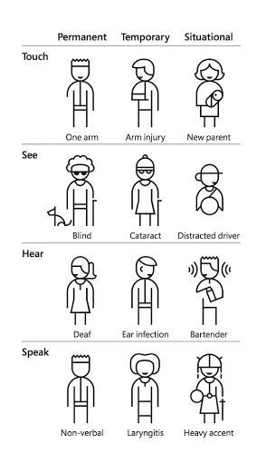

# Accessibility

* [General principles](#general-principles)
  * [What is accessibility?](#what-is-accessibility)
  * [Why do we care about accessibility?](#why-do-we-care-about-accessibility)
* [VPATs](#vpats)
* [How we conform](#how-we-conform)
  * [Standards we aim for](#standards-we-aim-for)
  * [Techniques](#techniques)
    * [Web Content Accessibility Guidelines](#web-content-accessibility-guidelines)
    * [WAI-ARIA Authoring Practices](#wai-aria-authoring-practices)
    * [Testing with real users](#testing-with-real-users)
    * [Resources](#resources)
    * [Tools](#tools)

## General principles

> The power of the Web is in its universality.
> Access by everyone regardless of disability is an essential aspect.
>
> _Tim Berners-Lee, inventor of the World Wide Web_

### What is accessibility?

The Web is fundamentally designed to work for all people, whatever their hardware, software, language, culture, location, or physical or mental ability. When the Web meets this goal, it is accessible to people with a diverse range of hearing, movement, sight, and cognitive ability.

Thus the impact of disability is radically changed on the Web because the Web removes barriers to communication and interaction that many people face in the physical world. However, when websites, web technologies, or web tools are badly designed, they can create barriers that exclude people from using the Web.

It is essential that the Web be accessible in order to provide equal access and equal opportunity to people with diverse abilities. Indeed, the [UN Convention on the Rights of Persons with Disabilities](https://www.un.org/development/desa/disabilities/) recognises access to information and communications technologies, including the Web, as a basic human right.

Accessibility supports social inclusion for people with disabilities as well as others, such as older people, people in rural areas, and people in developing economies.

### Why do we care about accessibility?

- *It's the right thing to do:* we have a duty to cater for all users regardless of ability. If we know that people can encounter difficulties accessing our content (which we do), and we know that we can do things to facilitate that access (which we do), then not making something accessible is knowingly contributing to the oppression of people with disabilities.
- *It's a legal requirement:* we're legally obliged in almost all jurisdictions worldwide to make our content accessible to users with diverse needs. Different jurisdictions may have different laws, for example the [UK Equality Act 2010](http://www.legislation.gov.uk/ukpga/2010/15/contents), [The Americans with Disabilities Act of 1990 and Revised ADA Regulations Implementing Title II and Title III](https://www.ada.gov/2010_regs.htm) and the individual member state laws drawing from the [European Accessibility Act 2025](https://eur-lex.europa.eu/legal-content/EN/TXT/?uri=CELEX%3A32019L0882). By adhering to the [Web Accessibility Guidelines (WCAG)](https://www.w3.org/TR/WCAG21/) we achieve legal conformity. Certain laws incorporate WCAG by reference instead of creating their own requirements, and WCAG is the technical gold standard for web accessibility worldwide.
- *It makes financial sense:* around 23% of working age adults in the UK are estimated to have some kind of permanent disability (Source: [Scope UK](https://www.scope.org.uk/media/disability-facts-figures)). Forrester Research found that *_57%_* of computer users aged 18 to 64 are "likely or very likely" to benefit from the use of assistive technology (Sources: [Microsoft](https://www.microsoft.com/en-us/download/details.aspx?id=18446), [Pubmed](https://www.ncbi.nlm.nih.gov/pmc/articles/PMC2788505/)). Also, taking into account people who are temporarily disabled, failing to make our websites accessible can cause a significant reduction in real market share.
- *It's a technical requirement:* catering for all users complements our [browser support policy](../practices/graded-browser-support.md) (we aim to support all browsers), and our use of [progressive enhancement](../practices/progressive-enhancement.md).

Accessible sites can be used by more people - including people with disabilities, people using mobile devices, older people, people with low literacy, people who are not fluent in the language of the site, people with low bandwidth connections to the Internet, people with older technologies, and new and infrequent web users.

Microsoft’s Persona Spectrum provides examples of permanent, temporary and situational disabilities. It demonstrates how accessible solutions can positively impact a larger number of people. ([Download Microsoft’s Inclusive 101 Guidebook (PDF)](https://inclusive.microsoft.design/tools-and-activities/Inclusive101Guidebook.pdf) for more information on inclusive design.)

(image &copy; Microsoft)

## VPATs

A Voluntary Product Accessibility Template (VPAT) is a reporting format document that explains how accessible a particular product is according to WCAG, EN 301 549, and Section 508 Standards. Our customers in the United States and the European Union use our VPATs to show that they comply with their local accessibility laws. The VPAT reporting format is published by ITI - see [https://www.itic.org/policy/accessibility/vpat](https://www.itic.org/policy/accessibility/vpat) for more information. 

A VPAT MUST be produced by you or your team for every product or service that we make commercially available in the United States. If something changes, e.g. accessibility is improved for a particular criteria, you MUST update the VPAT to reflect the change. You MUST NOT regress accessibility to below the level detailed in the VPAT.

You may use [our VPAT template](https://github.com/springernature/vpat) when evaluating your own products.

## How we conform

### Standards we aim for

Our target standards are [WCAG 2.1](https://www.w3.org/TR/WCAG21/) level AA.

As of mid-September 2018, WCAG 2.1 AA has been adopted in the European [EN 301 549 “Accessibility requirements for ICT products and services”](https://www.w3.org/blog/2018/09/wcag-2-1-adoption-in-europe/). This means that in order to comply with EN 301 549, your products MUST also comply with WCAG 2.1 to level AA.

As of January 18th 2018, WCAG 2.0 AA (the previous candidate recommendation) was incorporated by reference into Section 508 (see [Section 508 Refresh Part 1](https://www.paciellogroup.com/blog/2017/01/section-508-refresh-part-1/) by the Paciello Group).

Our expectation is that Section 508 will be updated to reference WCAG 2.1 in due course. Comply with WCAG 2.1 now to avoid retrofitting repairs later!

### Techniques

#### Web Content Accessibility Guidelines

You're expected to be aware of the [Web Content Accessibility Guidelines](https://www.w3.org/TR/WCAG21/) and to adhere to their recommendations. You're also expected to understand the foundational four principles of accessibility (Perceivable, Operable, Understandable, Robust) and to be able to apply them in your work. Be alert to the possibility of regressions that can't be detected by software.

The companion document [Understanding WCAG 2.1](https://www.w3.org/WAI/WCAG21/Understanding/) (Editor's Draft) explains what each of the success criterion in WCAG 2.1 actually means. You might also find the [Techniques for WCAG 2.1](https://www.w3.org/WAI/WCAG21/Techniques/) (Editor's Draft) useful when building features. 

W3C WAI have published a [quick reference document for WCAG](https://www.w3.org/WAI/WCAG21/quickref/?versions=2.0). It describes the WCAG success criteria and shows techniques and failures for each. We've also created [a simple accessibility checklist](accessibility-checklist.md), to help you become familiar with the guidelines/standards, and to aid you when manually assessing pages.

#### WAI-ARIA Authoring Practices

Use [WAI-ARIA](https://www.w3.org/TR/wai-aria/) roles and properties and [WAI-ARIA Authoring Practices](http://w3.org/TR/wai-aria-practices/) where they help to improve accessibility of your interfaces but you SHOULD NOT: 
* Use ARIA techniques to compensate for the abuse of semantics (e.g. do not apply `role="link"` to a `div` element, instead of using `a`, etc.);
* Use ARIA roles, properties, or design patterns without understanding what they do;
* Use ARIA roles, properties, or design patterns without testing them with assistive technologies.

The W3C [Using ARIA](https://www.w3.org/TR/using-aria/#NOTES) working draft explains why you shouldn't do those things. Familiarise yourself in particular with the First and Second Rules of ARIA!

#### Testing with real users

The best way to learn if your website works for people with disabilities is to get people with disabilities to test it for you.

You can arrange your own user testing, but it's better to engage a third party like the [Digital Accessibility Centre](http://www.digitalaccessibilitycentre.org/) to do this work for you. As professionals who specialise in accessibility testing and making recommendations, they're better at it than you.

#### Resources

You can find a [list of accessibility-related resources](../learning/web-accessibility.md) in the [Learning section of the Playbook](../learning/README.md).

#### Tools

A breakdown of the tools we recommend for testing accessibility, including assistive technology, can be found on the Playbook [Accessibility tools](tools.md) page.
